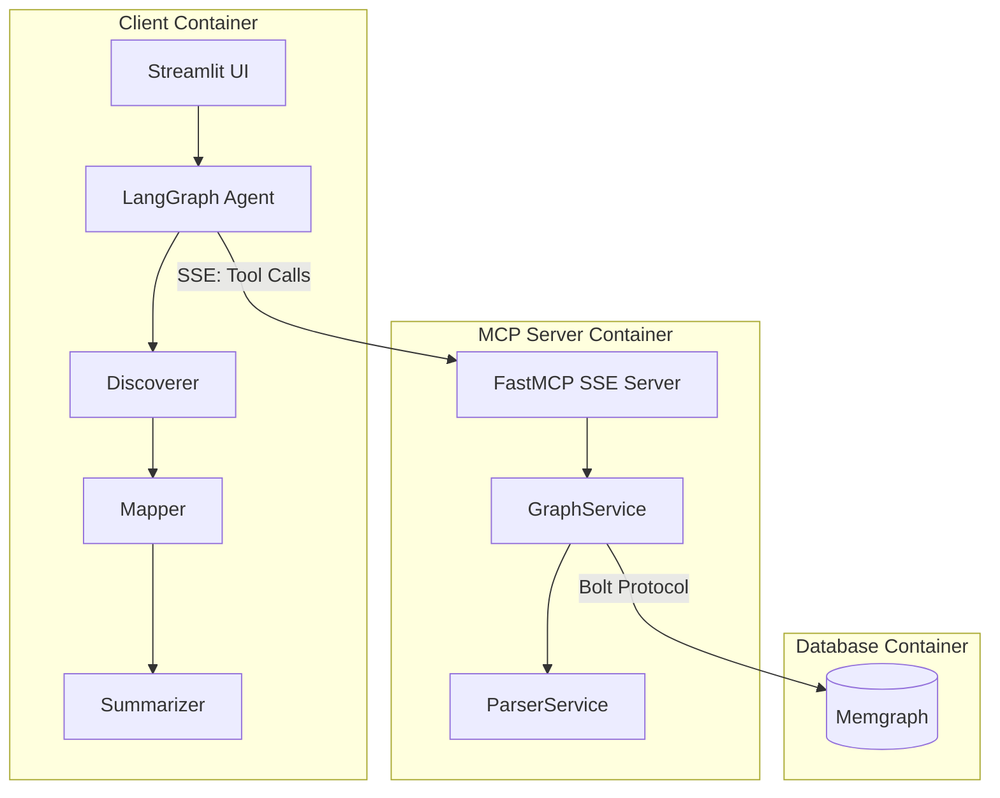

# 🤖 AI Code Documentation Assistant

> **An Agentic RAG system that ingests a codebase and answers questions about how it works, where functionality lives, API endpoints, dependencies, and architecture.**

[](https://www.python.org/)
[](https://github.com/jlowin/fastmcp)
[](https://github.com/langchain-ai/langgraph)
[](https://memgraph.com/)

---

## 📖 Table of Contents

1. [Quick Setup](#-quick-setup)
2. [Architecture Overview](#-architecture-overview)
3. [Application Flow (UI to DB)](#-application-flow-ui-to-db)
4. [File & Function Reference](#-file--function-reference)
5. [Why Memgraph over Basic RAG?](#-why-memgraph-over-basic-rag)
6. [RAG/LLM Approach & Decisions](#-ragllm-approach--decisions)
7. [Key Technical Decisions](#-key-technical-decisions)
8. [Engineering Standards](#-engineering-standards)
9. [Productionization Roadmap (AWS/GCP/Azure)](#-productionization-roadmap)
10. [What I'd Do Differently](#-what-id-do-differently)

---

## 🚀 Quick Setup

**Prerequisites**: Docker Desktop, OpenAI API Key

```bash
# 1. Clone
git clone https://github.com/ayushbaunthiyal/AI-Code-Documentation-Assistant-.git
cd AI-Code-Documentation-Assistant-

# 2. Configure
cp .env.example .env
# Edit .env and add your OPENAI_API_KEY

# 3. Run
docker-compose up --build

# 4. Access
# UI: http://localhost:8503
# Memgraph Lab: http://localhost:3000 (user: memgraph, pass: memgraph)
```

---

## 🏗 Architecture Overview

```
┌─────────────────────────────────────────────────────────────────────────────────┐
│                              DOCKER COMPOSE                                      │
├─────────────────────────────────────────────────────────────────────────────────┤
│                                                                                  │
│  ┌──────────────────┐       SSE/HTTP        ┌──────────────────────────────┐    │
│  │   CLIENT         │◄────────────────────►│     MCP SERVER                │    │
│  │   (Port 8503)    │                       │     (Port 8000)               │    │
│  │                  │                       │                               │    │
│  │  ┌────────────┐  │                       │  ┌─────────────────────────┐  │    │
│  │  │ Streamlit  │  │                       │  │  FastMCP (SSE Server)   │  │    │
│  │  │    UI      │  │                       │  └─────────────────────────┘  │    │
│  │  └─────┬──────┘  │                       │              │                │    │
│  │        │         │                       │              ▼                │    │
│  │  ┌─────▼──────┐  │                       │  ┌─────────────────────────┐  │    │
│  │  │ LangGraph  │  │   Tool Calls          │  │    GraphService         │  │    │
│  │  │   Agent    │──┼──────────────────────►│  │ (Ingestion + Queries)   │  │    │
│  │  │ Workflow   │  │  - ingest_repository  │  └─────────────────────────┘  │    │
│  │  │            │  │  - cypher_query       │              │                │    │
│  │  └────────────┘  │                       │              ▼                │    │
│  │                  │                       │  ┌─────────────────────────┐  │    │
│  │  DISCOVERER      │                       │  │    ParserService        │  │    │
│  │      ↓           │                       │  │ (Tree-sitter AST)       │  │    │
│  │  MAPPER          │                       │  └─────────────────────────┘  │    │
│  │      ↓           │                       │                               │    │
│  │  SUMMARIZER      │                       └──────────────┬────────────────┘    │
│  │                  │                                      │                     │
│  └──────────────────┘                                      │ Bolt Protocol      │
│                                                            ▼                     │
│                                              ┌──────────────────────────────┐    │
│                                              │        MEMGRAPH              │    │
│                                              │     (Graph Database)         │    │
│                                              │     Port 7687 (Bolt)         │    │
│                                              │     Port 3000 (Lab UI)       │    │
│                                              │                              │    │
│                                              │  Nodes: File, Class,         │    │
│                                              │         Function, Endpoint   │    │
│                                              │  Edges: DEFINED_IN           │    │
│                                              └──────────────────────────────┘    │
└─────────────────────────────────────────────────────────────────────────────────┘
```

### Component Diagram



---

## 🔄 Application Flow (UI to DB)

### 1. Ingestion Flow (When user clicks "Start Analysis")

```
User → [Streamlit UI] → [LangGraph] → [MCP Client] → [MCP Server] → [GraphService] → [ParserService] → [Memgraph]
```

| Step | Component | Action |
|------|-----------|--------|
| 1 | `app.py` | User enters GitHub URL, clicks "Start Analysis" |
| 2 | `app.py:56` | Calls `asyncio.run(ingest_codebase(repo_url))` |
| 3 | `agent.py:ingest_codebase()` | Invokes MCP tool `ingest_repository` via SSE |
| 4 | `main.py:ingest_repository()` | Tool wrapper, calls `GraphService.ingest_repository()` |
| 5 | `graph_service.py:ingest_repository()` | Clones repo, clears DB, walks files |
| 6 | `graph_service.py:_process_file()` | For each file: creates `File` node, parses AST |
| 7 | `parser_service.py:parse()` | Uses Tree-sitter to generate AST |
| 8 | `parser_service.py:extract_structure()` | Yields `Class`, `Function`, `Endpoint` tuples |
| 9 | `graph_service.py:_create_node()` | Writes nodes and `DEFINED_IN` edges to Memgraph |

### 2. Query Flow (When user asks a question)

```
User → [Streamlit UI] → [LangGraph Agent] → [Discoverer] → [Mapper] → [Summarizer] → UI
                                               ↓              ↓
                                            [MCP Tool]    [MCP Tool]
                                               ↓              ↓
                                           [Memgraph]    [Memgraph]
```

| Step | Agent | Action |
|------|-------|--------|
| 1 | `app.py` | User types question, presses Enter |
| 2 | `discoverer_agent()` | Queries `MATCH (f:File) RETURN f.path` for file context |
| 3 | `mapper_agent()` | Queries Classes, Functions, Endpoints, Relationships |
| 4 | `summarizer_agent()` | Synthesizes findings into natural language answer |

---

## 📁 File & Function Reference

### Client (`client/`)

| File | Purpose | Key Functions |
|------|---------|---------------|
| `app.py` | Streamlit UI entry point | Renders UI, manages session state, triggers ingestion |
| `agent.py` | LangGraph multi-agent workflow | `ingest_codebase()`, `get_graph_stats()`, `discoverer_agent()`, `mapper_agent()`, `summarizer_agent()` |

### MCP Server (`mcp_server/`)

| File | Purpose | Key Functions |
|------|---------|---------------|
| `main.py` | FastMCP server entry point | Defines `ingest_repository` and `cypher_query` tools |
| `app/core/config.py` | Pydantic Settings | `Settings` class validates env vars at startup |
| `app/core/logger.py` | Structured logging | `logger` instance (JSON in prod, colored in dev) |
| `app/services/graph_service.py` | Memgraph interaction | `ingest_repository()`, `_clone_repo()`, `_process_file()`, `_create_node()`, `execute_cypher()` |
| `app/services/parser_service.py` | Tree-sitter AST parsing | `parse()`, `extract_structure()` (detects Class, Function, Endpoint) |

---

## 🧠 Why Memgraph over Basic RAG?

### The Problem with Basic RAG

| Issue | Description |
|-------|-------------|
| **Chunk Isolation** | Traditional RAG splits code into chunks, losing structural relationships |
| **No Relationship Awareness** | "Who calls function X?" requires cross-chunk reasoning |
| **Hallucination Risk** | LLM guesses relationships instead of querying them |

### How Memgraph Solves It

| Feature | Benefit |
|---------|---------|
| **Native Graph Model** | Code structure IS a graph (Classes → Methods → Calls) |
| **Cypher Queries** | Precise queries like `MATCH (f:Function)-[:DEFINED_IN]->(file) RETURN f.name, file.path` |
| **Traversal Speed** | O(1) relationship lookups vs O(n) chunk scanning |
| **Semantic Preservation** | `DEFINED_IN`, `CALLS`, `INHERITS` edges maintain meaning |

### GraphRAG vs Vector RAG

```
                  Vector RAG                    GraphRAG (This Project)
                  ──────────                    ─────────────────────────
Input             Code chunks (500 tokens)     AST Nodes (Classes, Functions, Files)
Storage           Vector DB (Chroma, Pinecone) Graph DB (Memgraph)
Query             Semantic similarity          Cypher traversal
"Who calls X?"    ❌ Guesswork                 ✅ MATCH (n)-[:CALLS]->(:Function {name:'X'})
Relationships     Implicit (in embeddings)     Explicit (edges)
Explainability    Low (black box)              High (query results are traceable)
```

---

## 🤖 RAG/LLM Approach & Decisions

### LLM Choice

| Option Considered | Decision | Rationale |
|-------------------|----------|-----------|
| GPT-4o | ✅ **Selected** | Best reasoning for code understanding, tool-use capability |
| Claude 3.5 | ❌ Skipped | Equal capability but OpenAI SDK is more mature for LangChain |
| Llama 3 (local) | ❌ Skipped | Would require GPU infra, adds deployment complexity |

### Embedding Model

| Decision | Rationale |
|----------|-----------|
| **Not Used** | GraphRAG replaces embeddings with structural relationships |

### Vector Database

| Decision | Rationale |
|----------|-----------|
| **Not Used** | Memgraph replaces vector search with Cypher queries |

### Orchestration Framework

| Option | Decision | Rationale |
|--------|----------|-----------|
| LangGraph | ✅ **Selected** | Native state management, conditional edges, async support |
| AutoGen | ❌ Skipped | More complex setup, less control over flow |
| CrewAI | ❌ Skipped | Higher abstraction, harder to debug |

### MCP Protocol

| Decision | Rationale |
|----------|-----------|
| FastMCP over SSE | Standard protocol for tool execution, decouples client from server |

### Prompt & Context Management

```python
# Context Injection Strategy
mapper_agent():
    # 1. Query REAL data from Memgraph
    classes = cypher_query("MATCH (c:Class) RETURN c.name")
    functions = cypher_query("MATCH (f:Function) RETURN f.name")
    endpoints = cypher_query("MATCH (e:Endpoint) RETURN e.name, e.route")
    
    # 2. Inject as System Message
    context = f"## ACTUAL DATA: Classes: {classes}, Functions: {functions}, Endpoints: {endpoints}"
    
    # 3. Strict Instructions
    context += "\nUse ONLY this data. Do NOT hallucinate."
```

### Guardrails

| Guardrail | Implementation |
|-----------|----------------|
| Single-repo lock | `st.session_state.current_repo` prevents mixing contexts |
| Data-only answers | Prompt instructs: "Use ONLY the data provided" |
| Conciseness | Prompt: "Be CONCISE - 2-3 sentences unless detail requested" |

---

## 🔧 Key Technical Decisions

| Decision | Why |
|----------|-----|
| **Tree-sitter for AST** | Language-agnostic parsing, battle-tested in VS Code, supports Python/JS/TS/Go/Java |
| **Decorated function detection** | Enables FastAPI endpoint identification (`@app.get`, `@router.post`) |
| **SSE transport (not stdio)** | Enables HTTP-based tool calls, Docker network compatible |
| **gqlalchemy ORM** | Pythonic interface to Memgraph, reduces raw Cypher boilerplate |
| **Clean Architecture** | Services layer separates business logic from transport layer |
| **pydantic-settings** | Type-validated configuration, fails fast on missing env vars |
| **structlog** | JSON logging in prod, human-readable in dev, same API |
| **uv package manager** | 10-50x faster than pip, deterministic lockfiles |

---

## ✅ Engineering Standards

### Standards Followed

| Standard | Implementation |
|----------|----------------|
| **12-Factor App** | Config via env vars, stateless containers, logs to stdout |
| **Type Hints** | All Python functions are typed |
| **Dependency Injection** | Services instantiated at module level, imported where needed |
| **Single Responsibility** | `ParserService` parses, `GraphService` manages DB |
| **Error Handling** | Try/except with structured logging, graceful degradation |
| **Immutable Infrastructure** | Docker containers, no runtime mutations |

### Standards Skipped (Time Constraints)

| Standard | Reason |
|----------|--------|
| **Unit Tests** | Would add pytest suite for `ParserService.extract_structure()` |
| **Integration Tests** | Would test full ingestion pipeline with test repo |
| **CI/CD Pipeline** | Would add GitHub Actions for lint/test/build |
| **API Rate Limiting** | Not needed for single-user prototype |
| **Authentication** | Not in scope for prototype |

---

## ☁️ Productionization Roadmap

### AWS Deployment Architecture

```
┌─────────────────────────────────────────────────────────────────┐
│                           AWS VPC                                │
├─────────────────────────────────────────────────────────────────┤
│                                                                  │
│  ┌──────────────┐     ┌──────────────┐     ┌──────────────────┐ │
│  │   Route 53   │────▶│     ALB      │────▶│   ECS Fargate    │ │
│  │   (DNS)      │     │ (Load Bal.)  │     │  (Client + MCP)  │ │
│  └──────────────┘     └──────────────┘     └────────┬─────────┘ │
│                                                      │           │
│                                                      ▼           │
│                              ┌───────────────────────────────┐   │
│                              │     Amazon Neptune            │   │
│                              │  (Managed Graph Database)     │   │
│                              │  or EC2 + Memgraph            │   │
│                              └───────────────────────────────┘   │
│                                                                  │
│  ┌──────────────┐     ┌──────────────┐     ┌──────────────────┐ │
│  │   Secrets    │     │ CloudWatch   │     │      S3          │ │
│  │   Manager    │     │   (Logs)     │     │ (Cloned Repos)   │ │
│  └──────────────┘     └──────────────┘     └──────────────────┘ │
└─────────────────────────────────────────────────────────────────┘
```

### Scalability Enhancements

| Component | Current | Production |
|-----------|---------|------------|
| **Ingestion** | Synchronous | Celery/SQS queue for async processing |
| **Graph DB** | Single Memgraph | Memgraph HA Cluster or Neptune |
| **Client** | Single Streamlit | Multiple ECS tasks behind ALB |
| **Repo Storage** | Temp directory | S3 with lifecycle policies |
| **Secrets** | `.env` file | AWS Secrets Manager / Vault |
| **Logging** | stdout | CloudWatch / Datadog / Grafana |
| **Monitoring** | None | Prometheus + Grafana dashboards |

### Required Changes for Production

1. **Horizontal Scaling**: Run multiple MCP Server replicas behind a load balancer
2. **Database Persistence**: Enable Memgraph volume persistence or migrate to Neptune
3. **Authentication**: Add OAuth2/OIDC for user management
4. **Rate Limiting**: Add Redis-based rate limiting for API endpoints
5. **Caching**: Cache frequently queried graph patterns in Redis
6. **Async Ingestion**: Move ingestion to background workers (Celery/SQS)
7. **Observability Stack**: Add Prometheus, Grafana, distributed tracing (Jaeger)

---

## 🔮 What I'd Do Differently

### With More Time

| Area | Improvement |
|------|-------------|
| **Testing** | Add pytest suite with 80%+ coverage, integration tests with test repo |
| **Call Graph** | Parse `CALLS` relationships by analyzing function bodies, not just definitions |
| **Incremental Ingestion** | Only re-parse changed files on subsequent ingestions |
| **File Content Storage** | Store code snippets in nodes for in-context code display |
| **Streaming Responses** | Use SSE to stream agent responses to UI in real-time |
| **RAG Hybrid** | Combine GraphRAG with vector search for natural language code search |
| **Multi-language Support** | Add Go, Java, Rust parsers (Tree-sitter supports them) |
| **Visual Graph Explorer** | Embed Memgraph Lab or custom D3.js visualization in UI |
| **Feedback Loop** | Allow users to correct answers, fine-tune prompts based on feedback |

### Architecture Reconsiderations

| Current | Alternative |
|---------|-------------|
| Streamlit UI | FastAPI + React for better UX control |
| Sync ingestion | Async with progress WebSocket updates |
| Single LLM | Mixture-of-Experts (cheap model for routing, GPT-4 for complex) |
| Full repo clone | Shallow clone + sparse checkout for large repos |

---

## 📜 License

MIT License - See LICENSE file for details.

---

*Built with ❤️ using Python, LangGraph, Memgraph, and FastMCP*
